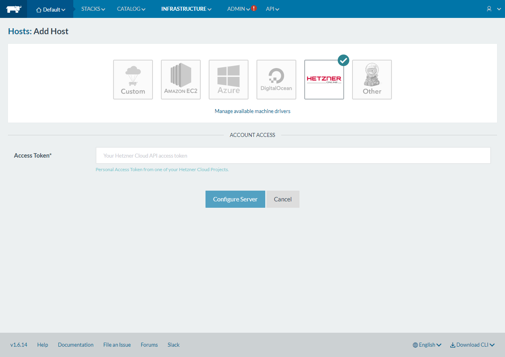
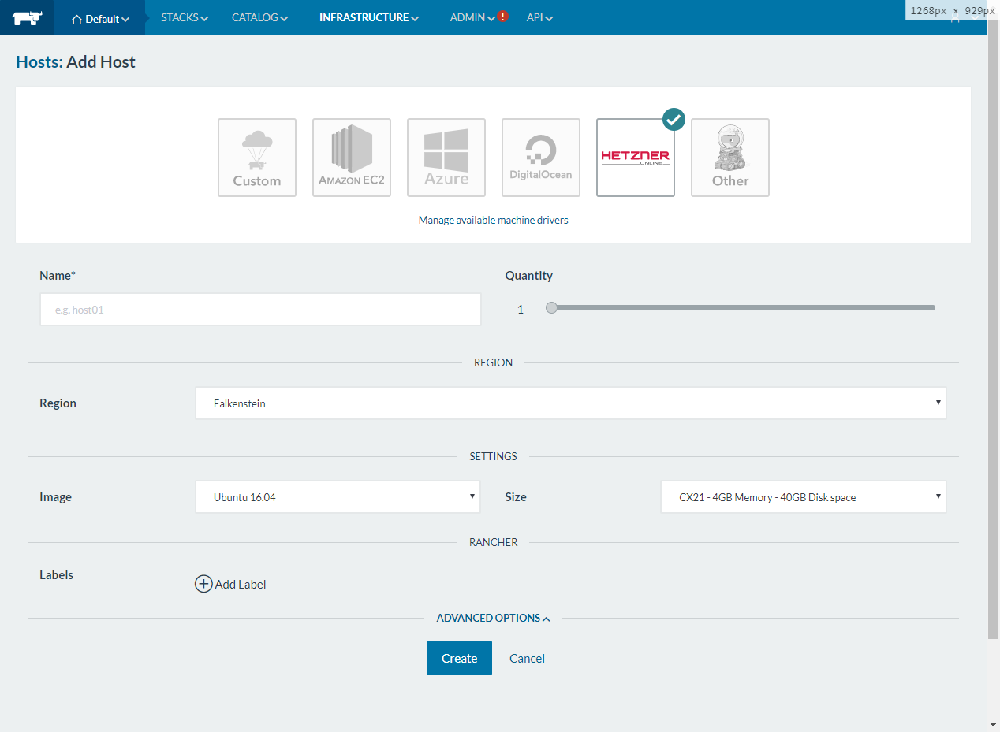

# Rancher 2 Hetzner Cloud UI Driver

Rancher 2.X UI driver for the [Hetzner Cloud](https://www.hetzner.de/cloud). For the Rancher 1 version check out the readme from the `v1.6` branch which you can find [here](https://github.com/mxschmitt/ui-driver-hetzner/blob/v1.6/README.md).

## Usage

* Add a Machine Driver in Rancher 2 (`Tools` -> `Drivers` -> `Node Drivers`)

| Key | Value |
| --- | ----- |
| Download URL | `https://github.com/JonasProgrammer/docker-machine-driver-hetzner/releases/download/2.0.1/docker-machine-driver-hetzner_2.0.1_linux_amd64.tar.gz` |
| Custom UI URL | `https://storage.googleapis.com/hcloud-rancher-v2-ui-driver/component.js` |
| Whitelist Domains |  `storage.googleapis.com` |

* Wait for the driver to become "Active"
* Go to Clusters -> Add Cluster, your driver and custom UI should show up.

## Compatibility

The following `component.js` is always compatible with the latest Rancher 2.X version:

`https://storage.googleapis.com/hcloud-rancher-v2-ui-driver/component.js`

### Rancher 2.0

Use this `component.js` to support Rancher 2.0 version:

`https://storage.googleapis.com/hcloud-rancher-v2-ui-driver/component-v20.js`

## Tested linux distributions

To use `Debian` e.g. with a non default Storage Driver, you have to set it manually in the Engine Options of the Node Template in Rancher.

### Recommend

| Image        | Docker Version                     | Docker Storage Driver  |
|--------------|------------------------------------|------------------------|
| Ubuntu 18.04 | 18.06                              | overlay2 (default)     |
| Ubuntu 16.04 | 18.06                              | aufs (default)         |
| Debian 9     | 18.06                              | overlay2, overlay      |
| CentOS 7     | 18.06                              | devicemapper (default) |
| Fedora 27    | not supported (due docker-install) |                        |
| Fedora 28    | not supported (due docker-install) |                        |

## Development

This package contains a small web-server that will serve up the custom driver UI at `http://localhost:3000/component.js`. You can run this while developing and point the Rancher settings there.
* `npm start`
* The driver name can be optionally overridden: `npm start -- --name=DRIVERNAME`
* The compiled files are viewable at http://localhost:3000.
* **Note:** The development server does not currently automatically restart when files are changed.

## Building

For other users to see your driver, you need to build it and host the output on a server accessible from their browsers.

* `npm run build`
* Copy the contents of the `dist` directory onto a webserver.
  * If your Rancher is configured to use HA or SSL, the server must also be available via HTTPS.

## Known Issues

### `Error creating machine: Error running provisioning: ssh command error:`

Try to use `overlay2` and if it does not work `overlay` as `Storage Driver` in the `Engine Options` in the bottom.
